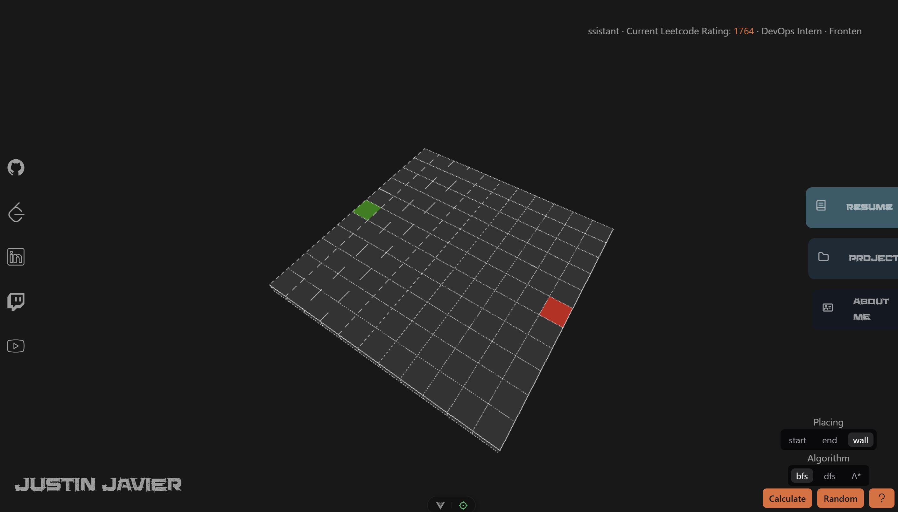

AnotherDayofTrying.Github.io
===

Personal website featuring a path-finding algorithm visualizer in desktop, and a 3D render for mobile.

    
        
    

Local Development
===================

**Requirements**
| Language | Version |
| --- | --- |
| Node | v20.x.x |

1. Navigate to `personal-website`
2. Install Packages `npm i`
3. Deploy development `npm run dev`

Note: host locally with `npm run dev -- --host`

Commit Checklist:
- [ ] Run build locally `npm run build`
- [ ] Move contents of `dist` folder to root folder
- [ ] Commit Changes